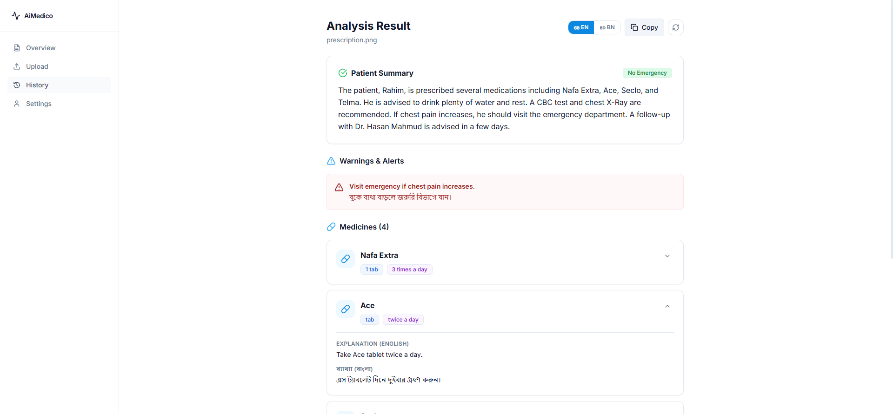

# AiMedico



**AiMedico** is an intelligent medical document analysis platform designed to help patients understand their prescriptions and lab reports. By combining multi-engine OCR with advanced AI processing, AiMedico translates complex medical jargon into clear, actionable, bilingual (English & Bangla) insights.

> **Disclaimer:** AiMedico is an educational tool. It is not a medical device and should not replace professional medical advice or diagnosis.

---

## 🏗️ Architecture

The project is structured into two main components:

### 1. Frontend (`/frontend`)
A modern, minimalist, and responsive web application built with:
- **Framework:** Next.js 14 (App Router)
- **Styling:** Tailwind CSS & Shadcn UI (Custom Minimalist Theme)
- **State Management:** Zustand
- **Forms & Validation:** React Hook Form & Zod
- **Icons:** Lucide React

### 2. Backend (`/aipart`)
A high-performance Python backend powering the AI and OCR pipelines:
- **Framework:** FastAPI
- **Database:** SQLite (Async) via SQLAlchemy 
- **OCR Engine:** EasyOCR (Primary for Windows) / Tesseract 
- **AI Processing:** OpenAI GPT-4o (Structured JSON extraction)
- **Image Processing:** OpenCV & Pillow

---

## 🚀 Getting Started

### Prerequisites
- Node.js (v18+)
- Python 3.10+
- OpenAI API Key

### Backend Setup
1. Navigate to the backend directory:
   ```bash
   cd aipart
   ```
2. Create and activate a virtual environment:
   ```bash
   python -m venv .venv
   .venv\Scripts\activate
   ```
3. Install dependencies:
   ```bash
   pip install -r requirements.txt
   ```
4. Set up environment variables:
   Copy `.env.example` to `.env` and add your `OPENAI_API_KEY`.
5. Run the server:
   ```bash
   python -m uvicorn app.main:app --reload
   ```

### Frontend Setup
1. Navigate to the frontend directory:
   ```bash
   cd frontend
   ```
2. Install dependencies:
   ```bash
   npm install
   ```
3. Run the development server:
   ```bash
   npm run dev
   ```

## 🔒 Features
- **Instant Upload:** Drag & drop support for prescriptions and medical images.
- **Dual Language Output:** Generates patient-friendly explanations in both English and Bangla.
- **Safety Detection:** Automatically highlights critical warnings and high-risk medical keywords.
- **Type-Safe Validation:** Strict alignment between frontend Zod schemas and backend Pydantic models.
